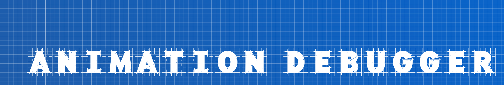

# Animations debugger

The Animation Debugger allows you to control animations by pausing, fast forwarding, rewinding, or playing in reverse order.

To do this, just wrap the existing `AnimationController` with a call of

```dart
//                                                   ⬇︎ Your old controller ⬇︎
final controller = AnimationDebugger.of(context).watch(AnimationController());
```

## How to use

To use the debugger you only need to complete two steps.

### Step one - use builder-wrapper in the root of your application:

```dart
class MyApp extends StatelessWidget {
  const MyApp({super.key});

  @override
  Widget build(BuildContext context) {
    return MaterialApp(
      debugShowCheckedModeBanner: false,
      theme: ThemeData(
        colorSchemeSeed: Colors.blueAccent,
      ),
      title: 'Animation Debugger',
      home: const MyHomePage(),
      builder: AnimationDebugger.builder, // ⬅︎ Use built-in builder
    );
  }
}
```

or, if you are already using some builders, then use builder-factory (in example we are using a builder from the library [bot_toast](https://pub.dev/packages/bot_toast#Example)):

```dart
class MyApp extends StatelessWidget {
  const MyApp({super.key});

  @override
  Widget build(BuildContext context) {
    return MaterialApp(
      debugShowCheckedModeBanner: false,
      theme: ThemeData(
        colorSchemeSeed: Colors.blueAccent,
      ),
      title: 'Animation Debugger',
      home: const MyHomePage(),
      builder: AnimationDebugger.builderWrapper(BotToastInit()), // ⬅︎ Use built-in builder-factory
    );
  }
}
```

### Step two - wrap your animation controllers

In order for Animation Debugger to understand which specific controllers you want to control, those controllers need to be subscribed to (it's actually a bit more complicated than that, but from your perspective it looks pretty much like this). Animation Debugger will be able to keep track of those of the controllers that you wrap as follows:

```dart
final AnimationController controller = AnimationDebugger.of(context).watch(AnimationController(debugLabel: 'some name'));
// or
final AnimationController controller2 = AnimationDebugger.of(context).watch(AnimationController(), label: 'just name');
```

Also, so that you can differentiate between controllers - it is highly recommended that you assign a unique and understandable `debugLabel` to each of them.

## Debugging

Great! After installing the debugger, you'll probably want to play around with some animations. To do this, you will have access to a widget placed on top of your application screen. When you click on it, you will see a list of your controllers that you can manage.

A few demonstrations:

|               Mobile                |                 Desktop                 |
|:-----------------------------------:|:---------------------------------------:|
|  |  |

Since the purpose of using this package may be to debug animations, in release mode Animation Debugger will not be embedded in the application and will not make itself known in any way.

## Restrictions

At the moment, only "bounded" controllers - those that have explicitly set time - can be controlled. Also, accelerated/delayed playback, changing playback time on the fly are not implemented at the moment.